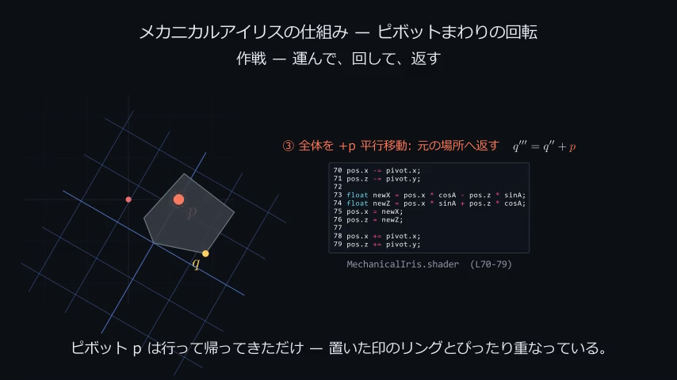

# Elevator-Iris-Explainer

[Cafe-Horizon-World-Framework](../Cafe-Horizon-World-Framework) のエレベーターの蓋
（**メカニカルアイリス**）の開閉機構が、**どういう行列計算で実装されているか**を
Manim のアニメーションで解説するリポジトリ。

蓋のベースオブジェクトは [IrisGen](../IrisGen)（Blender スクリプト）で生成され、
開閉そのものは Unity の頂点シェーダー `MechanicalIris.shader` が行列計算で行っている。
本リポジトリはその中でも核心となる「GPU でのピボットまわりの開閉回転」について
数式とアニメーションで可視化する。



## 何を解説するか

機構の心臓部は **「頂点カラーに焼き込んだヒンジ座標を中心とした 2D 回転」**:

$$ M = T(p)\,R(\alpha)\,T(-p), \qquad \alpha = \texttt{\_Open}\cdot 60^\circ $$

詳しい導出は [`docs/MATH.md`](docs/MATH.md) を参照。元ソースとの一致は
[`tests/`](tests/) で機械的に検証している。

## シーン一覧

| ファイル | クラス | 内容 |
|---|----------|------|
| `scenes/scene.py` | `RotateAboutPivot` | **核心**: 任意ピボット回転 \(T(p)R(\alpha)T(-p)\) を 9 アクトの一本道で解説 |

解説は次の流れで進む（`scene.py` 冒頭 docstring に詳細）:

1. **フック** — 実際の見た目（円形アパーチャ）の開閉と種明かし、なぜ数式で動かすか
2. **準備** — 羽根 1 枚・ピボット \(p\)・頂点 \(q\)・角度 \(\alpha=\texttt{\_Open}\times60^\circ\)
3. **素朴な失敗** — \(R(\alpha)\) をそのまま掛けると原点まわりに回ってしまう
4. **作戦** — 「運んで・回して・返す」3 ステップを実シェーダー行と同時に 1 回だけ演じる
5. **②の中身** — \(R(\alpha)q'\) の行×列 = シェーダー L73-74 の 2 行
6. **合成** — \(q'''=R(\alpha)(q-p)+p\)、並進部 \(t=p-R(\alpha)p\)、検算 \(Mp=p\)
7. **頂点カラー** — GPU が \(p\) を知る仕組み（エンコード/デコードの往復）
8. **フィナーレ** — 6 枚同時開閉 + clip で冒頭の見た目に帰着
9. **まとめ** — 焼き込み → 復元 → ピボット回転 → クリップの 1 枚カード

## セットアップ

```powershell
# Python 3.11+ / ffmpeg / LaTeX(MiKTeX 等) が必要
python -m pip install -r requirements.txt
```

- **ffmpeg**: 動画書き出しに必要。
- **LaTeX**: 数式 (MathTex) の描画に必要。Windows は MiKTeX 推奨
  （`scoop install latex`）。MiKTeX は不足パッケージを自動取得する。

## レンダリング

```powershell
# シーンを低品質でプレビュー
./render.ps1

# 高品質
./render.ps1 -Quality h

# 直接 Manim で実行する場合
manim -ql scenes/scene.py RotateAboutPivot
```

出力は `media/videos/...` 以下に生成される。

## テスト（数学の整合性検証）

`geometry.py` の実装が元ソース（`main.py` / `MechanicalIris.shader`）の式と
一致することを検証する。LaTeX 不要・numpy のみ:

```powershell
python tests/test_math_matches_shader.py
# pytest があれば
python -m pytest tests/
```

## 実シェーダーコードの併示

解説シーン（`scene.py`）は、解説する行列計算が **実シェーダー/スクリプトの何行目か** を、
行番号付きの実コードで併示する（回転を `MechanicalIris.shader L73-74`
と結ぶ）。コード断片は手書きせず `references/` に取り込んだ実ソースのスナップショットから
[`source_refs.py`](iris_explainer/source_refs.py) がアンカー文字列で抽出するため、
解説とシェーダーがズレない。スナップショットと兄弟リポジトリの実ファイルの一致は
[`tests/test_source_refs.py`](tests/test_source_refs.py) が検証する（乖離するとテストが落ちる）。

## 構成

```
iris_explainer/
  geometry.py       数学の単一情報源 (numpy のみ。元ソースの式を 1:1 で再現)
  theme.py          共通カラーパレット・フォント・項の色
  mathlib.py        Manim の数式/行列表示ヘルパー (LaTeX)
  manim_helpers.py  共通の Manim ヘルパー (色付き数式・羽根・実コード表示・接続矢印)
  source_refs.py    実シェーダー/スクリプトの抜粋を行番号付きで取得 (乖離防止)
references/         実シェーダー/スクリプトのスナップショット (表示用)
scenes/             各解説シーン (Manim)
tests/              geometry/抜粋 と元ソースの一致検証
docs/MATH.md        行列計算の導出ノート
```

## 元ソース

- 生成: `IrisGen/scripts/main.py`
- 開閉シェーダー: `Cafe-Horizon-World-Framework/Assets/Cafe-Horizon/World/LiveStage/Elevator/ElevatorCover/MechanicalIris/Shader/MechanicalIris.shader`
- 床穴マスク: 同 `Shader/FloorMask.shader`
- 制御: `.../Elevator/Script/Elevator.cs`, `Animation/ElevatorCover_Opening.anim`
